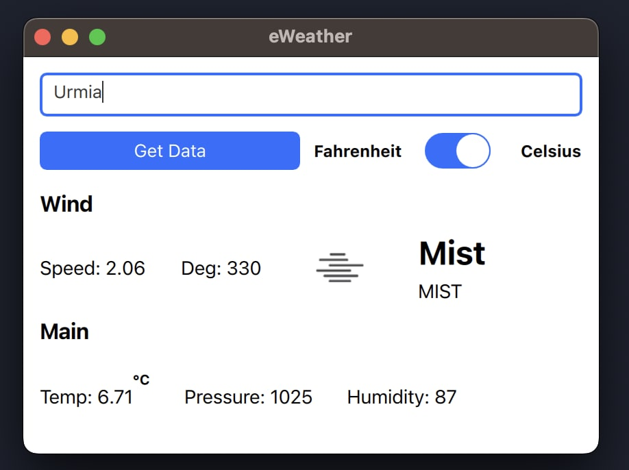

# eWeather

The eWeather is a GUI application that allows you to get the weather forecast for any city in the world. It is written in **C++** and **Qt** and uses the [OpenWeatherMap API](https://openweathermap.org/api) to get the weather data.



## Installation

### Linux

#### Dependencies

- Qt 6
- CMake 3.15

#### Build

```bash
mkdir build
cd build
cmake -G "Ninja" -S . -B build
cmake --build build
```

#### Run

```bash
./build/prettyWeather
```

### Windows

#### Dependencies

- Qt 6

#### Build

Open the project with Qt Creator and build the project.

#### Run

Run the `prettyWeather.exe` file.
